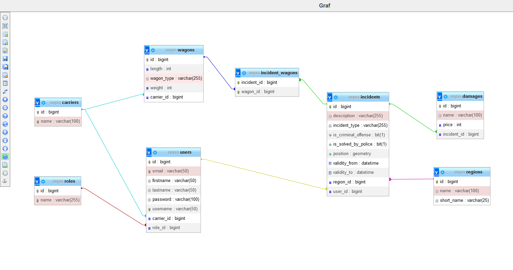
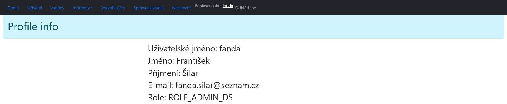
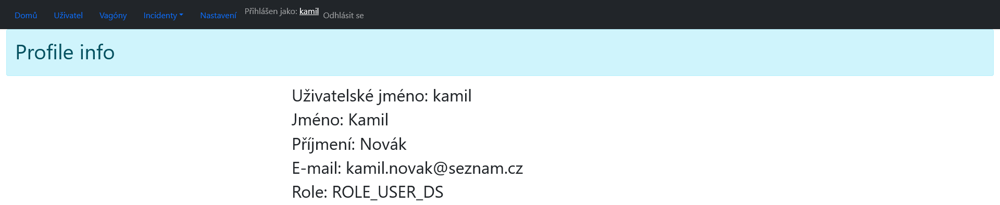
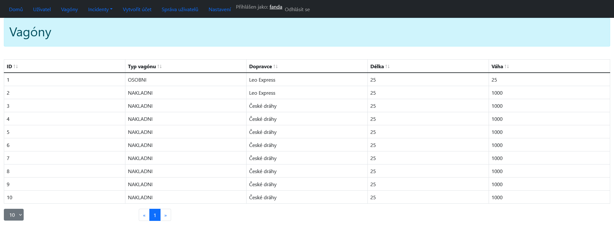
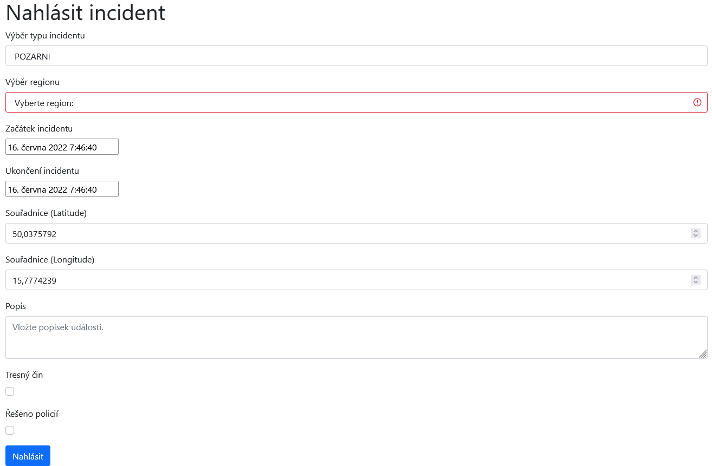
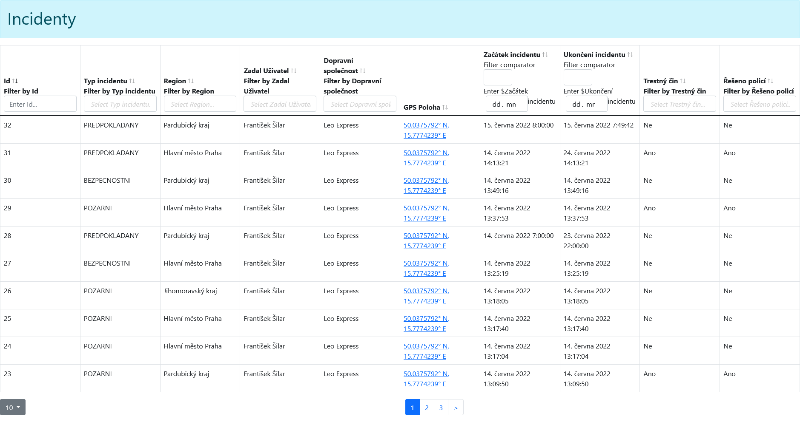
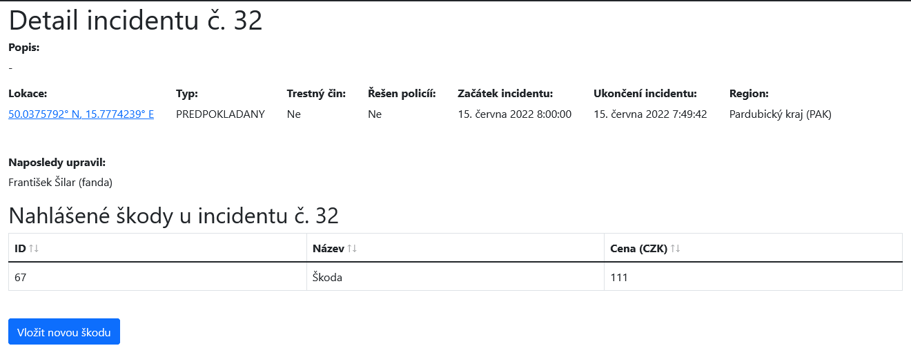
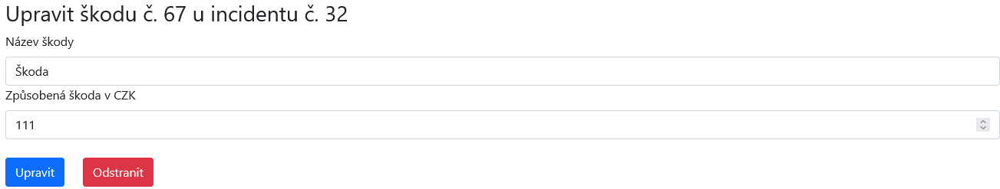

# NNPIA - Semestral Work

## Data Model

## BACKEND

### AUTHENTICATION CONTROLLER

#### BASE URL: /api/authentication

| Operation | Path    | Parameters                 | Body                                                        | Description                          |
|-----------|---------|----------------------------|-------------------------------------------------------------|--------------------------------------|
| `POST`    | /signin | loginRequest               | username and password                                       | Login user.                          |
| `POST`    | /signup | currentUser, signUpRequest | current logged user and new credentials of registering user | Create registration of the new user. |

### CARRIER CONTROLLER

#### BASE URL: /api/carriers

| Operation | Path        | Parameters     | Body | Description              |
|-----------|-------------|----------------|------|--------------------------|
| `GET`     |             |                | name | Get all carriers.        |
| `POST`    |             | carrierRequest |      | Create new carrier.      |
| `GET`     | /***{id}*** |                |      | Get specific carrier.    |
| `PUT`     | /***{id}*** | carrierRequest | name | Update specific carrier. |
| `DELETE`  | /***{id}*** |                |      | Delete specific carrier. |

### DAMAGE CONTROLLER

#### BASE URL: /api/damage

| Operation | Path                 | Parameters | Body                          | Description                           |
|-----------|----------------------|------------|-------------------------------|---------------------------------------|
| `GET`     |                      |            | id, name, price, incidentInfo | Get all damages.                      |
| `POST`    |                      | damageDto  | name, price, incidentID       | Create new damage.                    |
| `GET`     | /***{id}***          |            |                               | Get specific damage.                  |
| `GET`     | /incident/***{id}*** |            |                               | Get all damages by specific incident. |
| `PUT`     | /***{id}***          | damageDto  | id, name, price, incidentID   | Update specific damage.               |
| `DELETE`  | /***{id}***          |            |                               | Delete specific damage.               |

### INCIDENT CONTROLLER

#### BASE URL: /api/incident

| Operation | Path                          | Parameters  | Body                                                                                                                                        | Description                                  |
|-----------|-------------------------------|-------------|---------------------------------------------------------------------------------------------------------------------------------------------|----------------------------------------------|
| `GET`     | /all                          |             | id, position, validityFrom, validityTo, description, isCriminalOffense, isSolvedByPolice, incidentType, wagonsInfoDto, userInfo, regionInfo | Get all incidents.                           |
| `GET`     | /user/all                     |             |                                                                                                                                             | Get all incidents by the logged user.        |
| `GET`     | /carrier/***{carrierName}***  |             |                                                                                                                                             | Get all incidents by the carrier name.       |
| `GET`     | /type                         |             | name                                                                                                                                        | Get all incident types.                      |
| `GET`     | /carrier/***{incidentType}*** |             |                                                                                                                                             | Get all incidents by the incident type name. |
| `GET`     | /***{id}***                   |             |                                                                                                                                             | Get specific incident.                       |
| `POST`    |                               | incidentDto | position latitude, position longtitude, validityFrom, validityTo, description, isCriminalOffense, isSolvedByPolice, incidentType, regionID  | Create new incident.                         |
| `PUT`     | /***{id}***                   | incidentDto |                                                                                                                                             | Update specific incident.                    |
| `DELETE`  | /***{id}***                   |             |                                                                                                                                             | Delete specific incident.                    |

### Region CONTROLLER

#### BASE URL: /api/region

| Operation | Path               | Parameters | Body                | Description                                  |
|-----------|--------------------|------------|---------------------|----------------------------------------------|
| `GET`     |                    |            | id, name, shortName | Get all regions.                             |
| `GET`     | /name/***{name}*** |            |                     | Get specific region by the region type name. |
| `GET`     | /***{id}***        |            |                     | Get specific region.                         |
| `POST`    |                    | regionDto  | name, shortName     | Create new region.                           |
| `PUT`     | /***{id}***        | regionDto  |                     | Update specific region.                      |
| `DELETE`  | /***{id}***        |            |                     | Delete specific incident.                    |

### USER CONTROLLER

#### BASE URL: /api/user

| Operation | Path                   | Parameters  | Body                                                        | Description                                                    |
|-----------|------------------------|-------------|-------------------------------------------------------------|----------------------------------------------------------------|
| `GET`     |                        | currentUser | id, firstname, lastname, username, email, role, carrierInfo | Get current logged user.                                       |
| `GET`     | /***{username}***      |             |                                                             | Get specific user by username.                                 |
| `GET`     | /carrier               |             |                                                             | Get user list with same carrier as a carrier of a logged user. |
| `GET`     | /names                 |             |                                                             | Get all usernames list.                                        |
| `GET`     | /list                  |             |                                                             | Get all users list.                                            |
| `GET`     | /name/***{username}*** |             | boolean                                                     | Returns true, if specific username already exists.             |
| `DELETE`  |                        |             |                                                             | Delete current logged user.                                    |
| `DELETE`  | /***{id}***            |             |                                                             | Delete specific user.                                          |

### WAGON CONTROLLER

#### BASE URL: /api/wagons

| Operation | Path                  | Parameters                              | Body                                       | Description                                                     |
|-----------|-----------------------|-----------------------------------------|--------------------------------------------|-----------------------------------------------------------------|
| `GET`     |                       | pageNumber, pageSize, sortBy, direction | id, wagonType, length, weight, carrierInfo | Get all wagons. Optionally returns collection sorted and paged. |
| `GET`     | /type                 |                                         | name                                       | Get all wagon types.                                            |
| `GET`     | /type/***{name}***    |                                         |                                            | Get all wagons by the wagon type name.                          |
| `GET`     | /carrier/***{name}*** |                                         |                                            | Get all wagons by the carrier name.                             |
| `GET`     | /***{id}***           |                                         |                                            | Get specific wagon.                                             |
| `POST`    |                       | wagonDto                                | wagonType, length, weight                  | Create new wagon.                                               |
| `PUT`     | /***{id}***           | wagonDto                                |                                            | Update specific wagon.                                          |
| `DELETE`  | /***{id}***           |                                         |                                            | Delete specific wagon.                                          |

## FRONTEND

### LOGIN FORM

### REGISTER FORM

### ADMIN VIEW

### USER VIEW

### WAGON TABLE

### INCIDENT REPORT FORM

### INCIDENT TABLE

### INCIDENT DETAIL

### INCIDENT DAMAGE FORM

